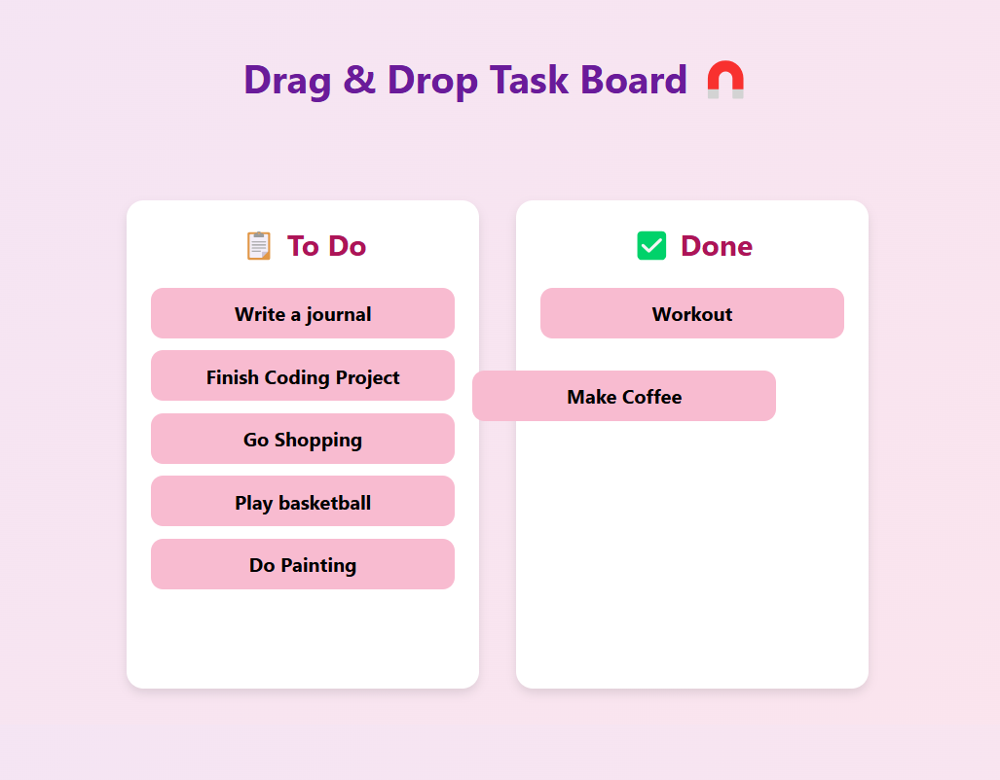

# 🧲 Drag and Drop Task Board

A minimal and interactive **drag-and-drop board** built with React. Organize your tasks between “To Do” and “Done” by simply dragging them around.

---

## 📌 Features
- ✅ **Draggable Tasks**: Move tasks between columns with ease.
- ✅ **Two Status Columns**: "To Do" and "Done".
- ✅ **Smooth Animations**: Courtesy of `react-beautiful-dnd`.
- ✅ **Modern UI**: Catchy colors, clean layout, mobile-friendly.
- ✅ **No Backend**: Fully front-end and self-contained.

---

## 🛠️ Technologies Used
- ⚛️ **React**
- 📦 **react-beautiful-dnd**
- 🎨 **CSS** (`board.css` for styling)

---

## 🚀 Live Demo
To see it in action, clone the repository and follow the setup instructions below.

1. **Clone the repository:**

   ```bash
   git clone https://github.com/Eshhaa11/drag-drop-task-board

2. **Navigate to the project directory:**

   cd drag-drop-task-board

3. **Install dependencies:**

   npm install

4. **Start the development server:**

   npm start

5. **Open your browser and visit:**

   http://localhost:3000

---

 ## 🎨 Screenshots:
 


 ---

 ## 🤝 Contributing:
 Want to improve this project? Fork the repository, create a feature branch, and open a pull request. All contributions are welcome! 🚀✨
 
 ---

 🎉 Happy Coding!
